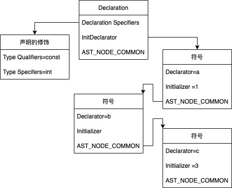
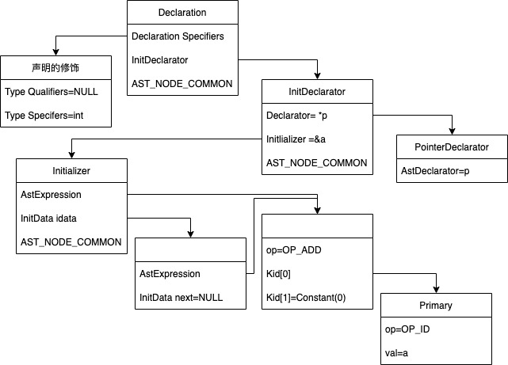
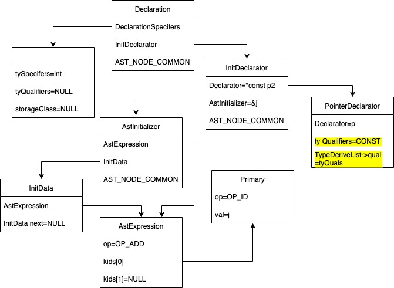
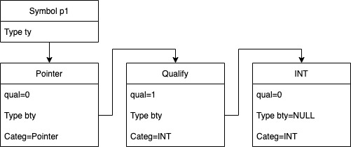
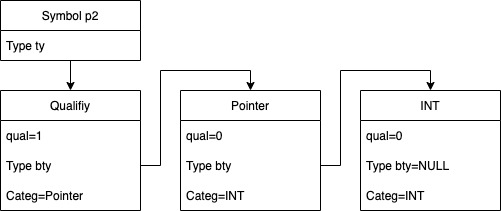

# const
主要记录下const修饰是如何从c生成汇编语言的

全局声明如下:

```
const int a;
```
生成未优化的代码:
```
# Code auto-generated by UCC
.data

.comm a,4
.text
```
会在赋值表达式检查报错
```
const int a;
void main()
{
    a = 1; // error
}
```
## 词法分析
---
在keyword.h加入const关键词，token.h增加TK_CONST。

## 语法分析
---
decl.c:

.lex.c的ParseDeclarationSpecifiers函数添加TK_CONST分支解析const。

.增加个AstNode tyQuals节点，语法阶段允许多个const修饰比如 const const const int a;在语义分析阶段报错。语法阶段ok


## 语义分析

declchk.c:

.把语法分析的结果或取出来赋值为qual(这样相同的多个const const const 就只有一个生效).然后赋值给ty域:specs->ty = Qualify(qual, ty);

exprchk.c:

.在CheckAssignmentExpression中检查a是否可以赋值，不能就报错

## 中间代码生成
---

## 汇编代码生成
---


# 补充 const 各种用法的汇编生成

## 修饰变量
---
### 例子1: 全局声明
```
const int a = 5, b, c = 3;
或者int const a = 5, b, c = 3;
```

从上图可以看到int const或者const int在语法分析阶段后就没有差异。
变量a,b,c会在语义分析阶段创建符号且生成各自的类型，然后将符号存到符号表Globals中,可以说符号表至关重要,保存了每个符号的所有信息(sclass,type,symbol kind),最后在汇编代码生成阶段(和中间代码生成没有关系)，EmitGlobals会根据符号的sclass或者是否有初始值生成
```
.comm b, 4
或者
.globl a
a:  .long 5
.globl c
c:  .long 3
汇编

.comm  symbol, length:
在bss段申请一段命名空间,该段空间的名称叫symbol, 长度为length. Ld连接器在连接会为它留出空间
.long
定义一个长整型，并为它分配空间，占四字节
.globl
定义一个全局符号，通常是为ld使用。
```
### 例子2: 局部声明
```
void main()
{
    const int a = 5, b, c = 3;
    // 或者 int const a = 5, b, c = 3;
    a = 2; // 将在语义分析的CheckAssignmentExpression()报错
}

asm
.BB0:
	movl $5, -4(%ebp)
	movl $3, -12(%ebp)
```
必须先解析函数定义，然后解析复杂语句的声明。解析得到的结构是和上面是一样的.语义检查除了把符号添加到符号表，还需要把变量符号添加到当前函数符号中(compStmt->ilocals),变量的生存周期作用域都在当前函数内，随着函数的存在而存在。

然后在中间代码生成中TranslateCompoundStatement函数,形成[指令，dst符号，src1符号，src2符号]的中间代码指令格式,在这里就是Move a, 5

根据栈帧结构,函数栈需要给临时变量和局部变量分配空间,-4就是a相对函数栈ebp指针的偏移量,-12是c相对ebp的偏移

### 例子3: 修饰指针
```
int i = 5, j = 6;
const int *p1 = &i;
int * const p2 = &j;
```
.指向常量的指针(p1 is pointer to const int)

语法树如下,Qualifiers为const


.常量指针(const p2 is pointer to int)

语法树如下

```

经典例子解释
void main()
{
    *p1 = 6; // error
    p1 = &j; // ok

    p2 = &i // error
    同上，p2符号指针ty是有const修饰的(在这行代码ty = DeriveType(initDec->dec->tyDrvList, decl->specs->ty);	生成)，ty->bty是没有const修饰的。看const是在dec的tyDrvList->qual中，还是在decl->specs->ty->qual中。
    *p2 = 1;
}
```
```
const int *p1 = &i;
*p1 = 6; // error
p1 = &j // ok
```

**error原因**: 符号p1的类型如上图,在CheckAssignmentExpression中expr->kids[0] = Adjust(CheckExpression(kids[0]), 0);调用CheckUnaryExpression将expr->kids[0]的ty指向Qualify节点了，之后CanAssign检查报错

**OK**:CheckAssignmentExpression中的expr->kids[0]不进入CheckUnaryExpressoin函数,expr->kids[0]->ty还是指向Pointer节点，CanAssign不报错
```
int * const p2 = &j;
p2 = &i // error
*p2 = 1;
```

**error原因**: 符号p2的类型如上图,在CheckAssignmentExpression中expr->kids[0] = Adjust(CheckExpression(kids[0]), 0);expr->kids[0]的ty指向Qualify节点了,之后的CanAssign报错

**OK**: *p2同样在CheckUnaryExpression中的Adjust去除Unqual之后将expr->kids[0]指向Pointer，然后判断是指针类型，expr->kids[0]指向INT类型，可以赋值！

### 例子4: 修饰函数形参
```
int add(const int a, const int b)
{
    // a = 1; error
    return a + b;
}
void main()
{
    int c;
    c = add(3, 4);
}
```
const作用到语义检查就结束，和汇编没什么关系,生成代码如下:
```
.globl add
add:
    pushl %ebp
    pushl %ebx
    pushl %esi
    pushl %edi
    movl %esp, %ebp
    subl $4, %esp
.BB0:
    movl 20(%ebp), %eax
    addl 24(%bp), %eax
    .jmp .BB2
.BB1:
.BB2:
    movl %ebp, %esp
    popl %edi
    popl %esi
    popl %ebx
    popl %ebp
.globl main
main:
    pushl %ebp
    pushl %ebx
    pushl %esi
    pushl %edi
    movl %esp, %ebp
    subl $8, %esp
.BB2:
    pushl $4
    pushl $3
    call add
    addl $8, %esp
    movl %eax, -4(%ebp)
.BB3:
    movl %ebp, %esp
    popl %edi
    popl %esi
    popl %ebx
    popl %ebp
```

