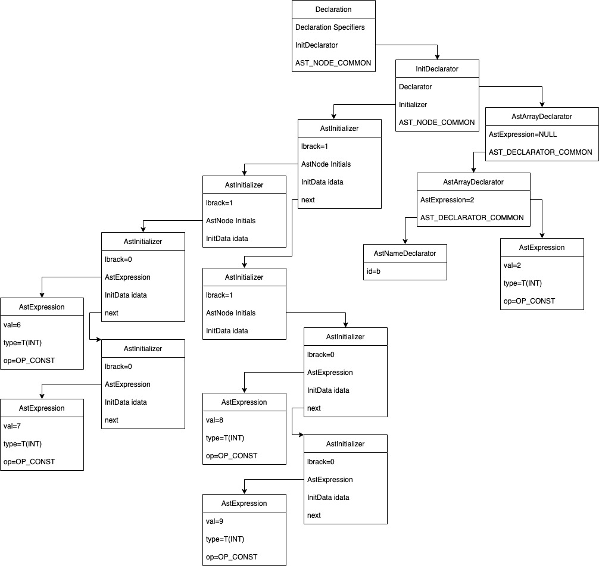

# Declaration with Initialize
主要记录下带初值初始化的声明是如何从c生成汇编语言的

全局声明如下:

```
int a = 1;
```
生成未优化的代码:
```
# Code auto-generated by UCC

.data
.globl a
a: .long 1
.text

```

## 词法分析
---

## 语法分析
---
decl.h: 新增语法节点AstInitDeclarator:包含dec节点记录a,以及init记录1,next指向下一个声明(无论带初值与否)

astDeclaration节点的成员AstDeclarator改为AstInitDeclarator成员

decl.c: ParseCommonHeader函数解析完声明说明符后，从原来的ParseDecalrator()变更为 ParseInitDeclarator(),然后 ParseInitDeclarator函数先解析Declarator(),然后ParseInitializer函数解析等号后面的值,创建AstInitializer语法树节点, 如果当前终结符不是左大括号, 则是一个赋值表达式 init->expr = ParseAssignmentExpression();

## 语义分析
---
CheckGlobalDeclaration:带初值的全局变量，调用 CheckInitializer()函数来 对初值进行检查; 由于全局变量的初值必须是常量，还需要调用CheckInitConstant()函数来处理，然后将InitData赋值给符号的成员idata,在汇编代码中使用。AsVar(sym)->idata = initDec->init->idata;

CheckInitializer:生成一个 struct initData 对象来记录初值, tail方便在initData后面插入。然后调用CheckInitializerInternal真正检查初值

```
static void CheckInitializer(AstInitializer init, Type ty)
{
	struct initData header;
	InitData tail = &header;
	header.next = NULL;
	CheckInitializerInternal(&tail, init, ty);
	init->idata = header.next; 
}

static void CheckInitializerInternal(InitData *tail, AstInitializer init, Type ty)
{
	InitData initd;
	if (IsScalarType(ty)) { // 用于对整型、浮点型和指针类型等标量类型的初始化进行检查
		init->expr = Adjust(CheckExpression(init->expr), 1);
		ALLOC(initd); // 创建一个 struct initData 对象，并将其加入由 struct initData 对象(header)构成的链表的末尾处
		initd->expr = init->expr; // =赋值表达式
		initd->next = NULL;
		(*tail)->next = initd; // header->next = initd
		*tail = initd; 
	}
	return ;
}
```

CheckInitConstant:
按 C 标准的规定，用于初始化全局变量或静态变量的初值应是常量，这样的好处是在 C 程序开始运行时，我们只需要从外存(或者从 ROM)中加载初值映像到内存即可，不需要执行额外的代码来计算初值。C++语言放宽了这个限制，在 C++中以下代码是合法的，即我们可以在运行时调用一个函数 f()来计算全局变量 number 的初值，这也意味着函数 f()会比 main()函数更早执行。但在 C 语言中，以下代码是非法的，其原因就在于 C 标准要求全局变量的初值为常量。
```
int f(void){
    //.... 
}
int number = f();
```
但对于以下函数 g 中的局部变量 local 来说，由于其所处栈空间是在运行时动态分配的， 我们可以调用函数 f()来对 local 进行初始化。这在 C 和 C++中都是合法的。
```
void g(void){
    int local = f();
}
```
由于有这样语义上的差别，在调用函数 CheckInitializer()完成对初值的检查后，对于全局变量和静态变量，我们还需要再检查一下其初值是否为常量，函数 CheckInitConstant()用于此目的。if 条件用于检查初值是否为常量，这包括 op 域为 OP_CONST 的语法树结点(例如整型或浮点型常数)、字符串常量 OP_STR 

## 中间代码生成
---

## 汇编代码生成
---
EmitGlobals根据变量a是否为extern，是否带有initData，分别生成各自的汇编代码。带有初值的声明通过下面代码生成汇编代码
```
			DefineGlobal(p); // 生成 .globl a
			DefineValue(initd->expr->ty, initd->expr->val); // a: .long 1
```

# 添加指针变量初始化
```
int a;
int *p = &a;
```
汇编代码
```
# Code auto-generated by UCC
.data
.globl	a
a:	.long	1
.globl	p
p:	.long	a
.text
```
## 语义分析
---
declchk.c中CheckInitConstant的if条件添加地址常量，对于地址常量的检查由CheckAddressConstant完成，地址常量的类型是指针类型。
在 C 语言中，&number 的类型是指针类型，但在汇编指令中，我们使用符号 number 即可表示一个地址常量


如上是语义分析完的语法树，&a翻译成a+offset的形式，函数中最后用于为 addr+k 构造一个进行 addr 和 k 之间加法运算的语法树结点

## 汇编代码生成
---
EmitGlobals函数对Globals中的符号在有带初始赋值的代码块中继续添加如果expr->op == OP_ADD的判断条件，然后生成.long a
```
			if (initd->expr->op == OP_ADD) {
				int n = initd->expr->kids[1]->val.i[0];
				DefineAddress((Symbol)initd->expr->kids[0]->val.p);
				PutString("\n");
			}
```

# 添加数组初始化
---
```
int arr[] = {1, 2, 3};
int a[2] = {4, 5};
int b[][2] = {{6, 7}, {8, 9}};
int c[2][2] = {{10, 11}, {12, 13}};
```
## 语法分析
---
```
static AstInitializer ParseInitializer()
{
	AstInitializer init;
	AstNode *tail;

	CREATE_AST_NODE(init, Initializer);
	if (CurrentToken == TK_LBRACE) {
		init->lbrace = 1;
		NEXT_TOKEN;
		init->initials = (AstNode)ParseInitializer();
		tail = &init->initials->next;
		while (CurrentToken == TK_COMMA) {
			NEXT_TOKEN;
			if (CurrentToken == TK_RBRACE) 
				break;
			*tail = (AstNode)ParseInitializer();
			tail = &(*tail)->next;
		}
		Expect(TK_RBRACE);
	} else {
		init->lbrace = 0;
		init->expr = ParseAssignmentExpression();
	}
	return init;
}
```
decl.c需要添加解析{}列表初始化部分,得到语法树如下


## 语义分析
---
在 CheckInitializerInternal 中添加if (ty->categ == ARRAY)分支检查数组， while 循环中递归地调用函数 CheckInitializerInternal() 检查{ }中的每一项，Type参数为ArrayType->ArrayType->T(INT)，对应的size为0，8，4,符号{{递归完后，具体的元素值会递归进入IsScalarType(ty)分支进行标量检查,每一个具体的元素都创建一个InitData记录其offset以及对应的expr(具体的值),通过next指针链接在一起。最后将链首记录在init的idata成员	init->idata = header.next;
```
offset:0	val:6
offset:4	val:7
offset:8	val:8
offset:12	val:9
```
缺少数组的维度,以及超出声明的大小，之后都进行相应的检查