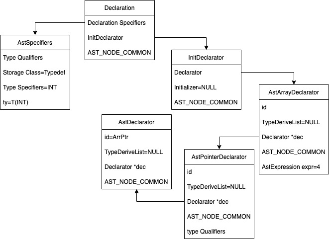
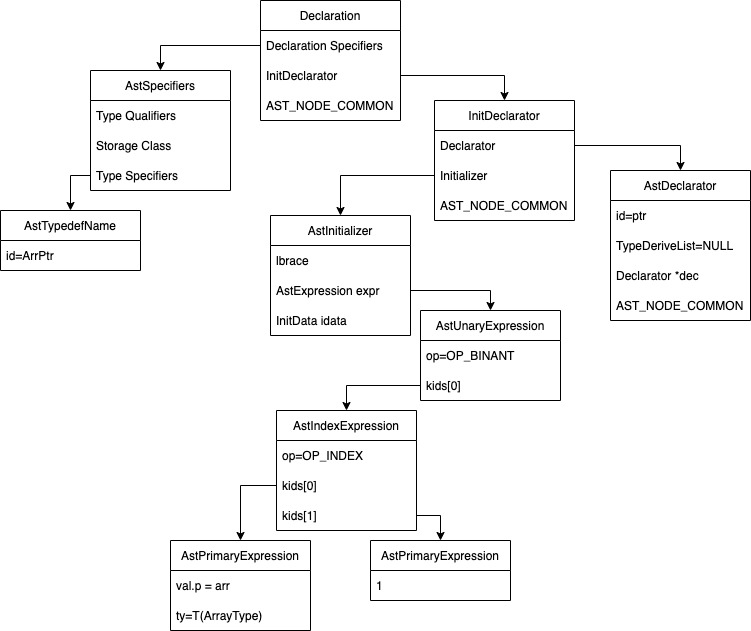
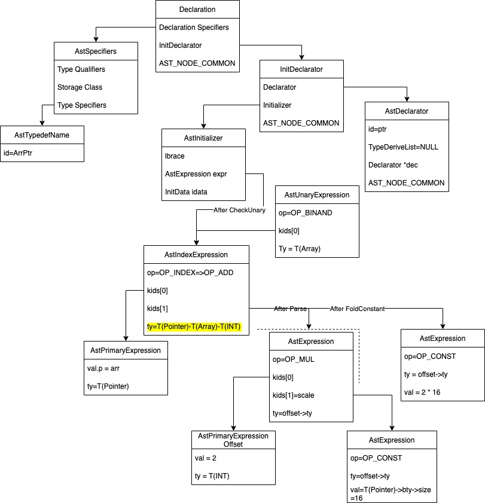

# typedef
主要记录下typedef是如何从c生成汇编语言的

全局声明如下:

```
typdef int A;
A a;
```
生成未优化的代码:
```
# Code auto-generated by UCC
.data

.comm a,4
.text
```

## 词法分析
---
在keyword.h加入typedef关键词，token.h增加TK_TYPEDEF。

## 语法分析
---
decl.c:

.typedef 在语法分析阶段作为stgClass看待, int还是type specifier节点，解析int时设置seeTy=1表示已经有类型限定符了，否则A会作为TK_ID也在这个阶段被解析。 A是TK_ID应该解析在ParseDirectDeclarator; 

.ParseDeclarationSpecifiers函数添加TK_TYPEDEF分支和TK_STATIC相同的处理。解析完后，通过CheckTypedefName函数将符号A添加到TypedefNames，用于保存typedef的新类型。之后碰到TK_ID就会通过IsTypedefName函数判断是否在TypedefNames的向量中

.A a;全局声明中的A在ParseDeclarationSpecifers作为TK_ID解析，因此添加TK_ID分支,创建AstTypedefName节点，成员id=A,设置seeTy=1

## 语义分析
---
declchk.c:

.typedef int A;生成的语法树节点NK_Token,在CheckDeclarationSpecifiers中主要给sclass赋值为TK_TYPEDEF,以及specs->ty=T(INT);然后在CheckGlobaDeclaration中根据sclass==TK_TYPEDEF进行CheckTypedef将符号A通过AddTypedefName加入到符号表中。

.A a;生成的语法节点时NK_TypedefName,在CheckDeclarationSpecifiers中根据节点的kind,获取符号表中的符号A,然后生成符号a的specs->ty=sym->ty;typedef作用到此结束，之后就是和int a;一样的中间代码生成和汇编代码生成

## 中间代码生成
---

## 汇编代码生成
---

# 添加 typedef 用法
---

```
int arr[3][4];
typedef int (*ArrPtr)[4];
ArrPtr ptr = &arr[0];
```
## 语法分析
---
decl.c需要在ParseDirectDeclarator添加解析(*Dec)格式的代码

typdef声明的语法结构如下图:



从叶节点往根节点读,ArrPtr is pointer to an array which has 4 int elements.也就是说ArrPtr是一个指针而已。


```
ArrPtr ptr = &arr[1];
```


## 语义分析
---

语义检查后，ArrPtr的类型T(Pointer)->T(ARRAY)->T(INT)，也就是左边ptr的类型

等号右边&arr[1].在checkPostfixExpression中arr的type调整为T(Pointer)->T(ArrayType)->T(INT);
CheckUnaryExpression后,expr指向[]语法节点，该节点type=T(Pointer)->T(ArrayType)->T(INT)。等号两边类型形容

# 更多例子
```
void f()
{
    typedef struct {
        int a[4];
    } Data;
}
Data dt;
int main(int arg, char *argv[])
{
    return 0;
}
```

1.函数内部typedef 定义符号Data名字，它的level处于1，Data dt; 在ParseDeclarationSpecifiers中，到TK_ID时候，调用IsTypedefName判断Data是否为typedef的名字，但是因为tn->level > Level所以返回false。报错！

```
typedef int ccc; 
void g(int ccc)
{ 
    ccc a; // 如果不添加OverloadNames，这里就不会报错
}
ccc c;
```
增加如下代码:
```
		FOR_EACH_ITEM(TDName, tn, v)
			if (tn->id == id && Level > tn->level) {
				tn->overload = 1;
				tn->overloadLevel = level;
				INSERT_ITEM(OverloadNames, tn);
				return ;
			}
		ENDFOR
```
1.int ccc; 做完ParameterDeclaration后进行PreCheckTypedef,然后调用CheckTypedef，v是TypdefNames，对v里面的成员检查是否需要重载的，形参和typedef重名，将ccc的overload=1，overloadLevle=1,再将tn加入到OverloadNames中，

2.ccc a;属于Stmt解析, 判断当前ccc不是type就直接break: if (CurrentToken == TK_ID && !IsTypeName(CurrentToken))。然后ccc a;进入ParseStatement,因为没有添加LabelStatment，直接调用ParseExpressionStatment，进入ParsePrimaryExpression解析a，CurrentToken = TK_ID,在ParseExpressionStatment的Expect(TK_SEMICOLON)报错。

3.在退出函数g作用域后调用PostCheckTypedef把overloadNames全部清空，否则ccc c;和ccc a;报相同错误

# Example
```
void f(void)
{

}
typedef void (*FUNCPTR)(void);
FUNCPTR ptr = f;
```

1 typedef 的语法树可知，FUNCPTR是指向返回类型为void且参数为void类型的函数的指针(函数指针).
```
			FunctionDeclarator
				/  				
	PointerDeclarator  
			/
		FUNCPTR
```

2 FUNCPTR ptr = f; 带初值的初始化。CheckGlobalDeclaration函数日常检查完等号左边(形成类型，以及符号添加到符号表中),对于右边调用CheckInitializer检查expr，然后Adjust将节点调整为指向函数的指针。